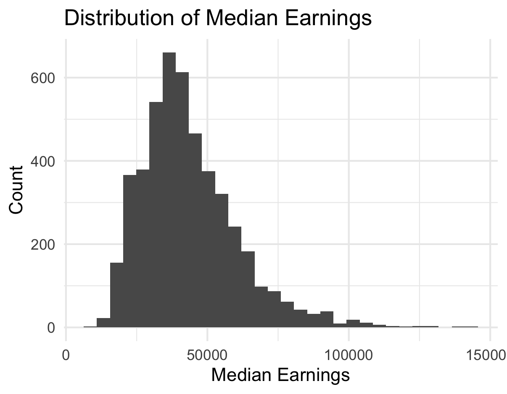
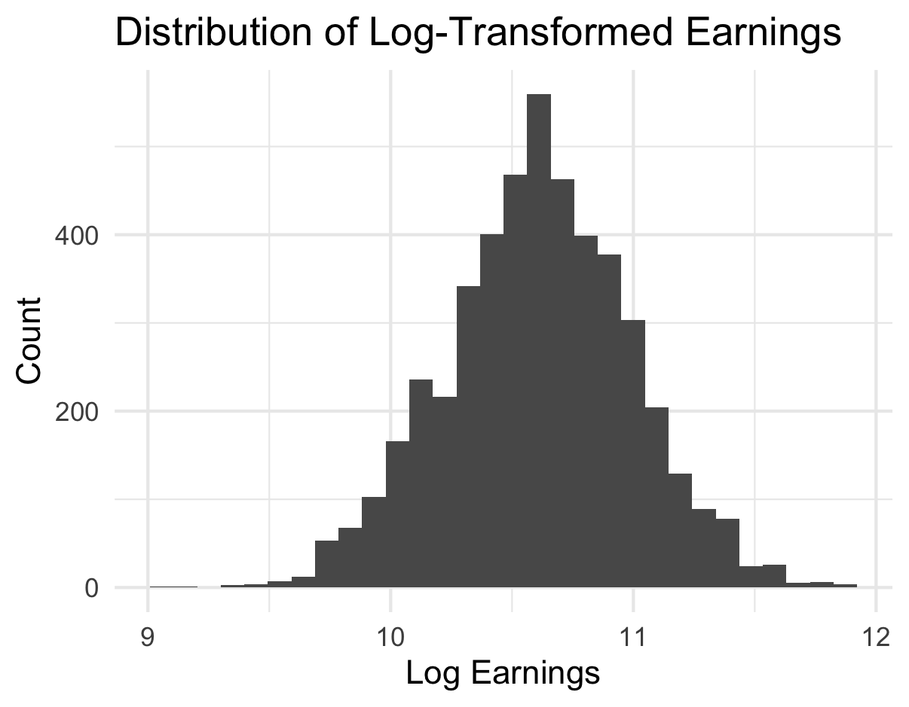
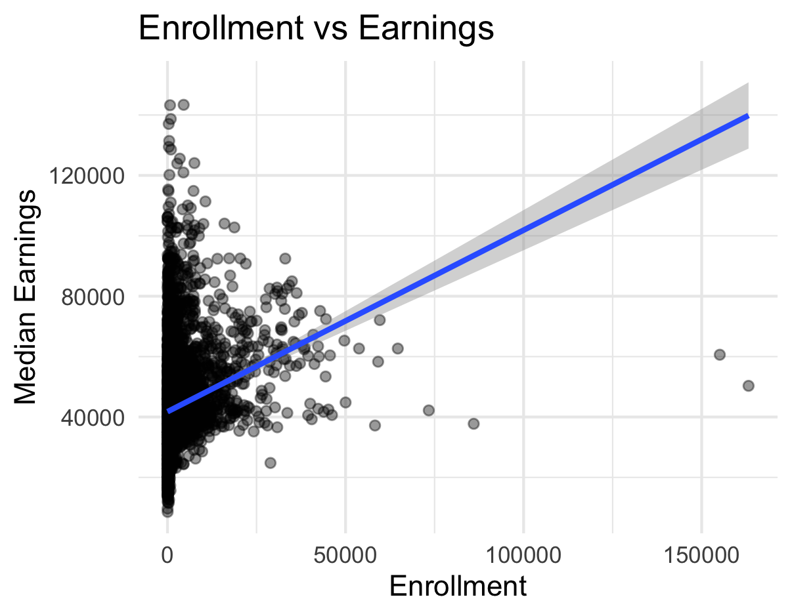
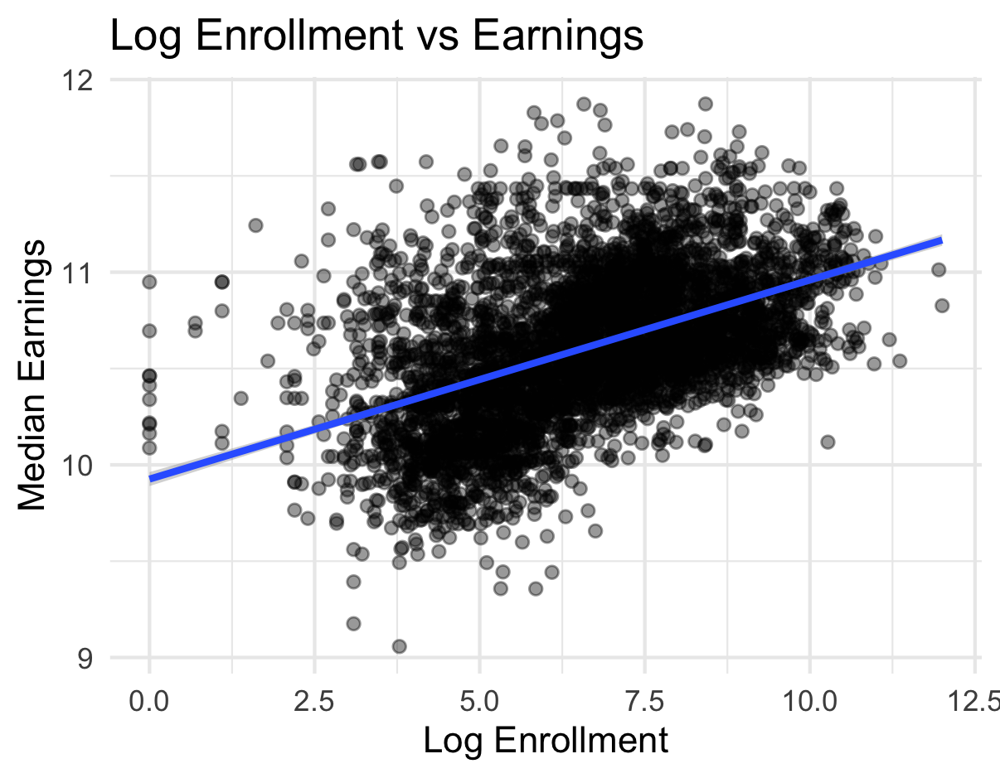
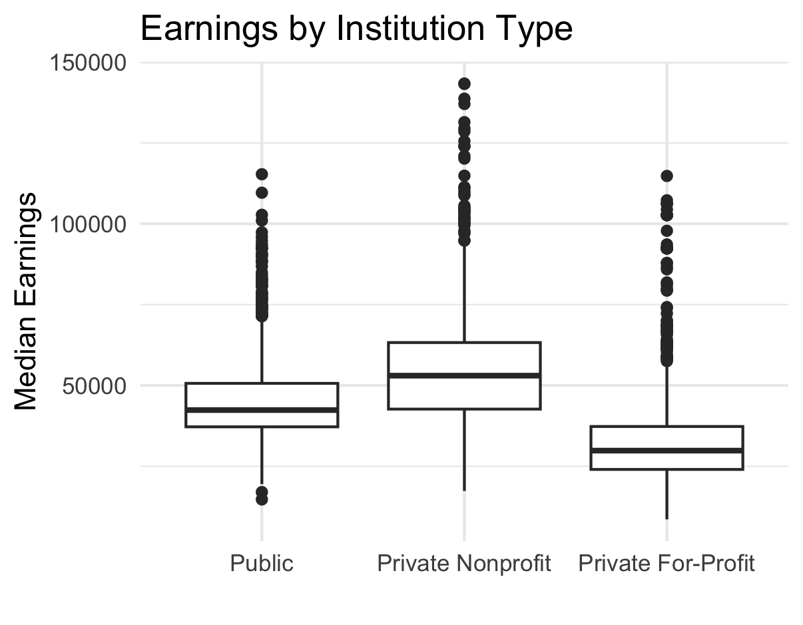
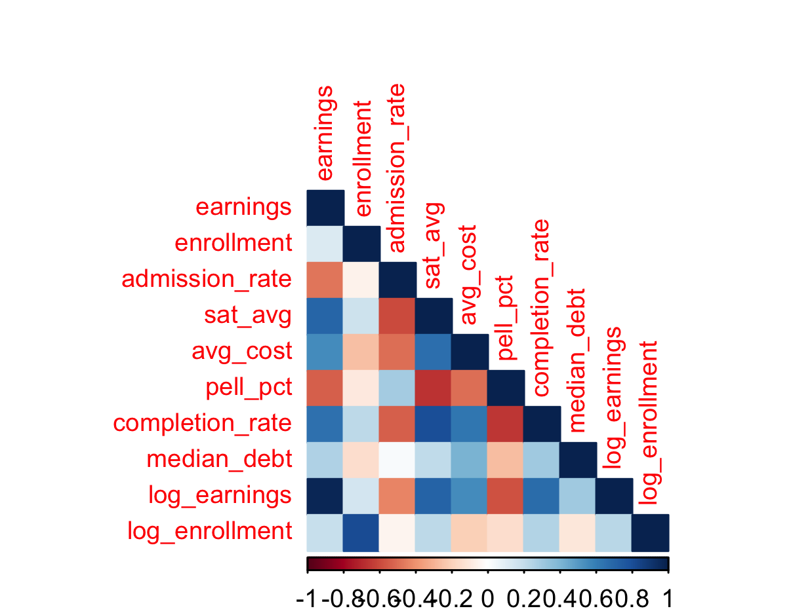
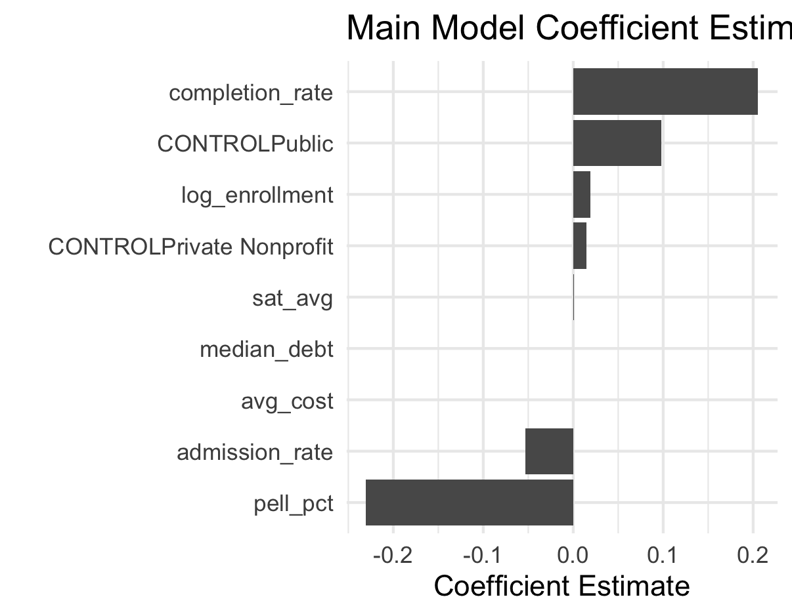
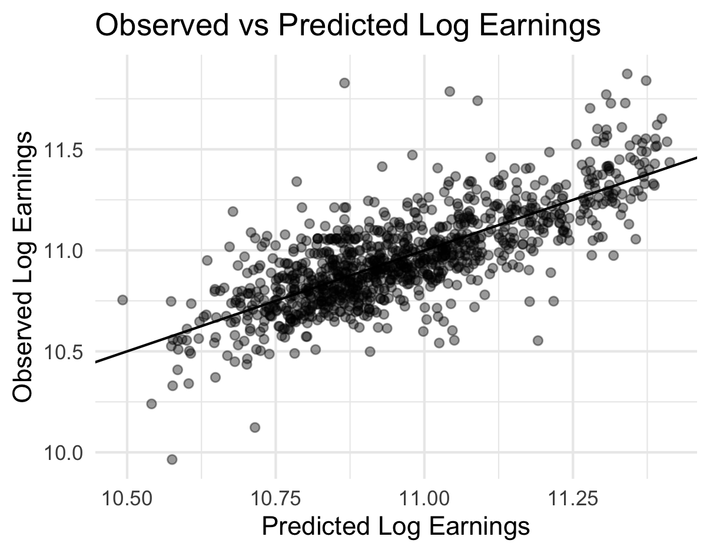
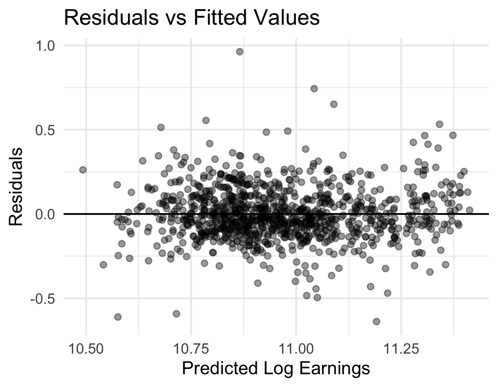
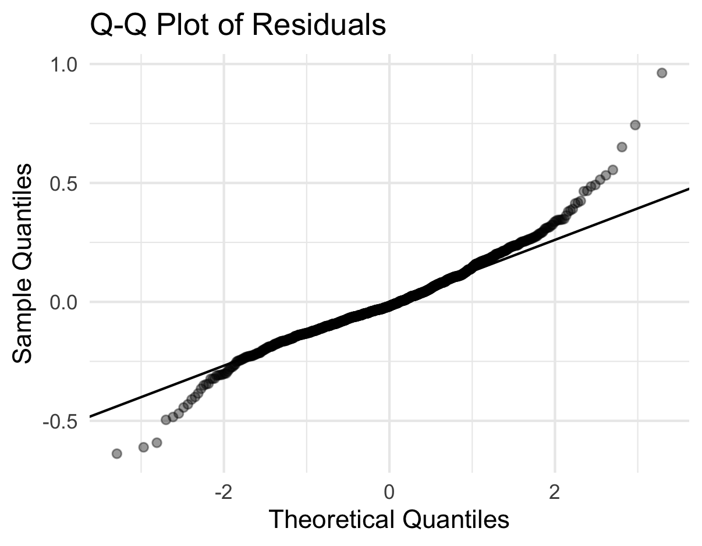

```{r setup, include=FALSE}
knitr::opts_chunk$set(echo = TRUE)
```

## Final Analysis

The primary goal of this project was to better understand which institutional characteristics are associated with higher post-graduation earnings outcomes for students. Rather than focusing on simple descriptive statistics alone, the analysis combined exploratory data analysis, feature engineering, multiple regression modeling, and diagnostic testing to evaluate both the strength and reliability of the relationships in the dataset.

The project began with an exploratory analysis of the earnings variable itself. One of the first observations was that median earnings were strongly right-skewed, meaning that while most institutions clustered around lower-to-middle earnings levels, a smaller number of institutions had exceptionally high earnings outcomes. This type of skew is common in economic and salary-related data and can create problems for linear regression because the model assumes more stable variance and approximately normal residual behavior.

Because of this, a log transformation was applied to the earnings variable. The transformed distribution appeared much more symmetric and approximately normal, making it more suitable for regression analysis and easier to interpret statistically.

```{r, out.width="50%", fig.align="center"}

```

```{r, out.width="50%", fig.align="center"}

```


A similar issue appeared with enrollment size. Raw enrollment values varied dramatically across institutions, with some universities enrolling extremely large student populations compared to smaller colleges. When visualizing enrollment against earnings directly, the relationship appeared compressed and difficult to interpret because the extreme enrollment values dominated the scale of the plot.

To address this, enrollment was also log-transformed. After transformation, the relationship between enrollment and earnings became much clearer and more linear. This decision was important because linear regression models perform better when predictor relationships are approximately linear rather than heavily skewed or exponential in shape.

```{r, out.width="50%", fig.align="center"}

```

```{r, out.width="50%", fig.align="center"}

```

The exploratory analysis also revealed substantial differences in earnings across institution types. Private nonprofit institutions generally showed the highest median earnings distributions, while private for-profit institutions tended to have lower earnings outcomes overall. Public institutions typically fell between the two groups.

This pattern provided a strong justification for including institution control type (`CONTROL`) as a categorical predictor in the final regression model rather than treating all schools as structurally identical.

```{r, out.width="50%", fig.align="center"}

```

To better understand relationships between variables before modeling, a correlation matrix was also created. The matrix showed several meaningful patterns. Completion rate and SAT average were positively associated with earnings, while Pell Grant percentage and admission rate showed negative relationships. These findings suggested that institutional selectivity, graduation outcomes, and student socioeconomic composition all likely play important roles in explaining earnings variation.

However, the correlations also demonstrated why a multiple regression framework was necessary. Many institutional variables were related to each other simultaneously, meaning that simple pairwise correlations alone would not fully isolate the contribution of each predictor.

```{r, out.width="60%", fig.align="center"}

```

The modeling phase began with a baseline regression model using only log enrollment as a predictor of log earnings. The purpose of this baseline model was to establish a simple benchmark and evaluate whether institutional size alone meaningfully explained earnings outcomes.

The baseline model explained only a small portion of the variation in earnings, indicating that enrollment by itself was not a strong predictor.

A more comprehensive multiple regression model was then developed using the following predictors:

- Log enrollment
- SAT average
- Completion rate
- Pell Grant percentage
- Admission rate
- Average cost
- Median debt
- Institution control type

This expanded model substantially improved predictive performance, achieving an R-squared of approximately 0.58. This suggests that the included institutional characteristics collectively explain a meaningful share of the variation in post-graduation earnings outcomes.

Importantly, the results suggest that earnings outcomes are shaped by a combination of institutional selectivity, student demographics, graduation outcomes, and financial characteristics rather than any single factor alone.

The coefficient estimates provided additional insight into the direction and magnitude of these relationships.

Completion rate emerged as one of the strongest positive predictors in the model. Institutions with higher graduation rates tended to be associated with higher predicted earnings outcomes, even after controlling for other variables. Public and private nonprofit institutions also showed positive associations relative to private for-profit schools.

Pell Grant percentage showed one of the strongest negative relationships with earnings. This does not imply that Pell recipients themselves cause lower earnings outcomes. Instead, it likely reflects broader socioeconomic inequalities that influence educational opportunities, labor market access, and post-graduation outcomes.

Admission rate also showed a negative relationship with earnings, suggesting that more selective institutions tend to be associated with stronger earnings outcomes. Meanwhile, average cost and median debt showed smaller positive relationships after controlling for the other institutional variables in the model.


```{r, out.width="55%", fig.align="center"}

```

After fitting the model, diagnostic plots were used to evaluate whether the regression assumptions were reasonably satisfied.

The observed vs. predicted plot showed a strong positive linear relationship between predicted and actual earnings values, suggesting that the model captured a meaningful amount of structure in the data.


```{r, out.width="55%", fig.align="center"}

```

The residuals vs. fitted values plot showed residuals generally centered around zero without strong systematic patterns. While some mild heteroscedasticity appeared at higher fitted values, the overall spread of residuals suggested that the model assumptions were reasonably acceptable given the size and complexity of the dataset.

```{r, out.width="55%", fig.align="center"}

```

The Q-Q plot showed that residuals followed the normal reference line fairly closely in the center of the distribution, although deviations appeared in the tails. This indicates the presence of some outliers and heavier-than-normal tails, which is common in large real-world institutional and economic datasets.


```{r, out.width="55%", fig.align="center"}

```

Overall, the results suggest that institutional earnings outcomes are strongly associated with a combination of selectivity, student composition, graduation success, and institutional structure. The project also demonstrates the importance of preprocessing decisions such as log transformations, careful variable selection, and diagnostic testing when working with real-world economic and educational data.

At the same time, the findings should not be interpreted causally. The regression model identifies statistical associations rather than proving that changing one institutional characteristic would directly cause earnings outcomes to increase or decrease. Many additional factors — including geographic location, labor market conditions, field of study composition, and unobserved student characteristics — likely also contribute to variation in earnings outcomes.
